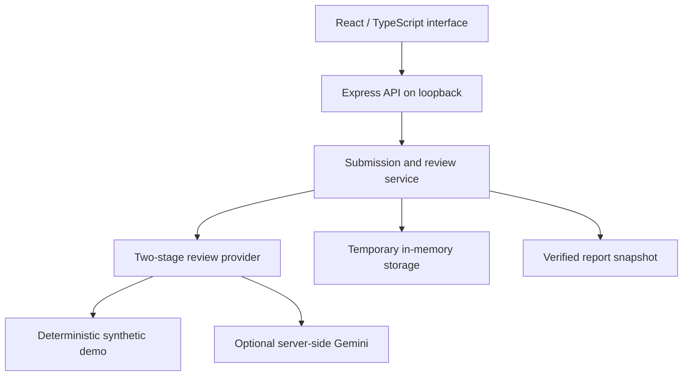

# IELTS Writing Review Platform

A local full-stack demo for reviewing practice writing: AI proposes draft estimates and feedback, a human reviewer resolves suggestions, and a verified report records the final decision.

## Overview

This portfolio release adapts the provider contracts, two-stage AI pipeline, structured-output validation, and score immutability checks from a larger private application. It adds a small React interface and an Express API so the review workflow can run independently with original synthetic content.

It demonstrates **software engineering, AI integration, and product workflow design**. It is an unauthenticated local demo, not a production assessment service or an official IELTS scoring tool.

## Key features

- Submit practice writing while preserving the original response.
- Run scoring and feedback as separate stages; reuse the frozen scoring result when retrying feedback.
- Validate structured AI output and feedback offsets, rejecting unsupported or ambiguous text anchors.
- Accept, edit, or reject each suggested correction.
- Keep human band estimates separate from AI draft estimates.
- Require resolved suggestions, reviewer notes, and explicit verification before publishing a report.
- Preserve a published report snapshot and prevent later edits through the API.

## Architecture



`src/lib/ai` contains reusable provider contracts, schema parsing, offset validation, scoring reuse, and immutability checks. `server` handles submission state, reviewer decisions, publication gates, and API validation. `src/App.tsx` presents the write → review → report flow.

## AI + human review

AI output is a draft for inspection. Reviewers must resolve every suggestion and provide their own estimates and notes before publication. Frozen AI estimates remain visible alongside the human decision. This separation prevents an AI retry or reviewer edit from silently changing an earlier scoring result.

The default **mock mode** makes no external AI requests. Its fixed illustrative estimates demonstrate application behavior; they do not measure writing quality. Optional Gemini output is also uncalibrated and requires human review.

## Tech stack

React · TypeScript · Vite · Node.js · Express · Gemini REST API · Vitest

Storage is in memory and resets when the API process restarts. No hosted database, production policies, account system, or authentication is included.

## Local setup

Use Node.js **24 LTS** and npm. The checked-in lockfile fixes dependency versions.

```sh
git clone https://github.com/minhiungan2608/ielts-writing-review-platform.git
cd ielts-writing-review-platform
npm ci
cp .env.example .env.local
npm run dev
```

Open **http://127.0.0.1:5173**. The UI and API bind to loopback; the API runs on port 3001. Leave all environment values blank to use the synthetic demo. Submit the supplied sample, analyze it, resolve suggestions, add reviewer notes, confirm verification, and publish the report.

For optional Gemini use, set these values **only in `.env.local`**:

```dotenv
AI_PROVIDER=gemini
GEMINI_API_KEY=
GEMINI_MODEL=
```

Supply your own key and a model available to your account. The API sends the key in a server-side request header; the browser receives neither the key nor environment values. Gemini mode sends submitted writing to the provider and may incur charges. Use synthetic writing only. See [Google's API-key guidance](https://ai.google.dev/gemini-api/docs/api-key).

## Testing / quality

```sh
npm run typecheck
npm test
npm run build
```

The 20 tests cover score reuse and immutability, malformed AI output, offset validation, reviewer publication gates, report snapshots, invalid inputs, loopback/origin guards, and a complete submit → analyze → review → publish → report API round trip. `npm run lint` currently runs the TypeScript check; there is no separate ESLint configuration.

To inspect the built client, run `npm run api` and, in another terminal, `npm run preview`; open http://127.0.0.1:4173. Building produces the client bundle, not a production server deployment.

## Privacy / demo data

The prompt, response, and fixtures were written for this demo. The release contains no production student records, teaching corpus, commercial exam assets, database snapshots, private connection defaults, or copied Git history. Environment files, build output, and dependencies are ignored. No private application screenshots are included.

## Project status

Implemented: the local end-to-end workflow, optional Gemini integration, structured validation, human review, and report publication gates.

Limitations: no authentication, persistent storage, deployment, concurrent-user guarantees, official score calibration, browser automation tests, or production security claim. Live Gemini quality and model availability were not validated during the mock-mode checks. The cloud browser could not access the local demo, so no demo screenshots are presented as verified evidence.
